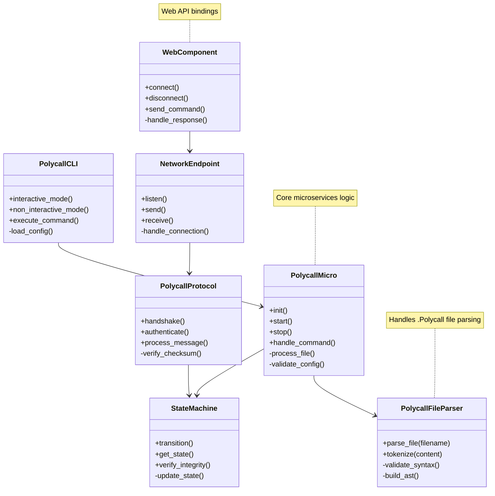

```mermaid
classDiagram
    class PolycallMicro {
        +init()
        +start()
        +stop()
        +handle_command()
        -process_file()
        -validate_config()
    }

    class PolycallFileParser {
        +parse_file(filename)
        +tokenize(content)
        -validate_syntax()
        -build_ast()
    }

    class PolycallCLI {
        +interactive_mode()
        +non_interactive_mode()
        +execute_command()
        -load_config()
    }

    class WebComponent {
        +connect()
        +disconnect()
        +send_command()
        -handle_response()
    }

    class NetworkEndpoint {
        +listen()
        +send()
        +receive()
        -handle_connection()
    }

    class PolycallProtocol {
        +handshake()
        +authenticate()
        +process_message()
        -verify_checksum()
    }

    class StateMachine {
        +transition()
        +get_state()
        +verify_integrity()
        -update_state()
    }

    PolycallMicro --> PolycallFileParser
    PolycallMicro --> StateMachine
    PolycallCLI --> PolycallMicro
    WebComponent --> NetworkEndpoint
    NetworkEndpoint --> PolycallProtocol
    PolycallProtocol --> StateMachine

    note for PolycallFileParser "Handles .Polycall file parsing"
    note for WebComponent "Web API bindings"
    note for PolycallMicro "Core microservices logic"
```